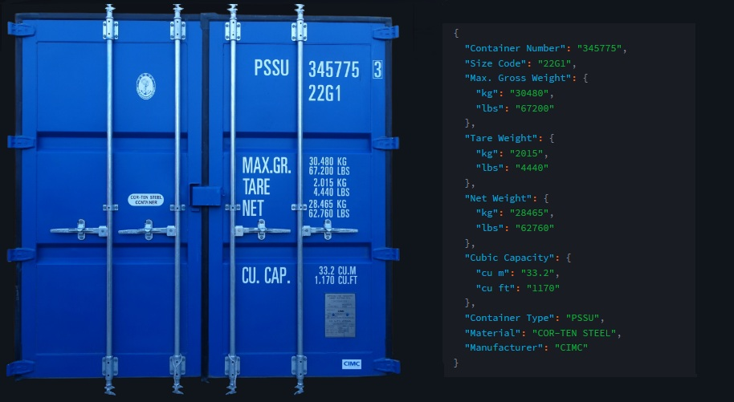

# Container Number Extractor (CNE)
The **Container Number Extractor (CNE)** is used to extract the container details into structured JSON format. It uses **OCR** (Optical Character Recognition) technology to extract the details from the container and then give the output in ***Structured JSON*** format.

## Project Components

- Python
- Streamlit (platform) for Frontend
- Google's generativeai (package) 
  

## Final Outcome

